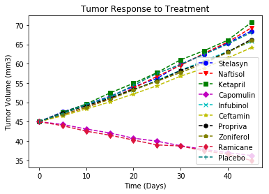
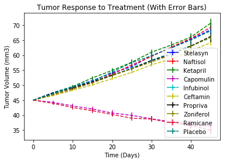
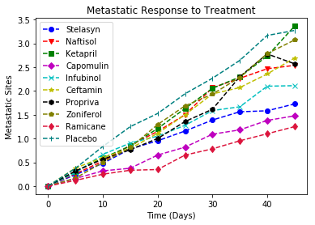
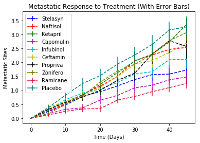
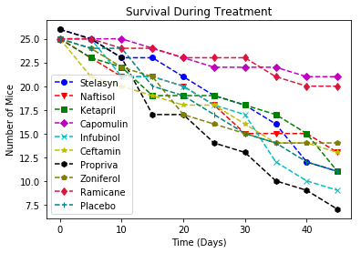
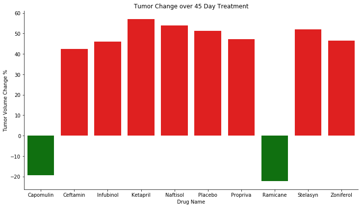

```python
import matplotlib.pyplot as plt
import numpy as np
import pandas as pd
import seaborn as sns
```


```python
clinicaltrial_data = pd.read_csv('clinicaltrial_data.csv')
```


```python
mouse_drug_data = pd.read_csv('mouse_drug_data.csv')
```


```python
merged_df = pd.merge(clinicaltrial_data, mouse_drug_data, on='Mouse ID')
```


```python
# Tumor Response to Treatment
drug_group = merged_df.groupby(['Drug', 'Timepoint'])
avg_drug_group = drug_group.mean()
```


```python
# List of Drugs
drugs_list = mouse_drug_data['Drug'].unique()
drugs_list
```


    array(['Stelasyn', 'Naftisol', 'Ketapril', 'Capomulin', 'Infubinol',
           'Ceftamin', 'Propriva', 'Zoniferol', 'Ramicane', 'Placebo'],
          dtype=object)


```python
# pivot table for Tumor Response to Treatment scattor plot
tumor_volume_table = pd.pivot_table(avg_drug_group, values='Tumor Volume (mm3)', index='Timepoint', columns='Drug')
```


```python
# Tumor Response to Treatment
fig, ax = plt.subplots(1)

plt.title("Tumor Response to Treatment")
plt.xlabel("Time (Days)")
plt.ylabel("Tumor Volume (mm3)")

ax.plot(tumor_volume_table[['Stelasyn']], marker='o', color='b', linestyle='--', label='Stelasyn')
ax.plot(tumor_volume_table[['Naftisol']], marker='v', color='r', linestyle='--', label='Naftisol')
ax.plot(tumor_volume_table[['Ketapril']], marker='s', color='g', linestyle='--', label='Ketapril')
ax.plot(tumor_volume_table[['Capomulin']], marker='D', color='m', linestyle='--', label='Capomulin')
ax.plot(tumor_volume_table[['Infubinol']], marker='x', color='c', linestyle='--', label='Infubinol')
ax.plot(tumor_volume_table[['Ceftamin']], marker='*', color='y', linestyle='--', label='Ceftamin')
ax.plot(tumor_volume_table[['Propriva']], marker='h', color='k', linestyle='--', label='Propriva')
ax.plot(tumor_volume_table[['Zoniferol']], marker='p', color='olive', linestyle='--', label='Zoniferol')
ax.plot(tumor_volume_table[['Ramicane']], marker='d', color='crimson', linestyle='--', label='Ramicane')
ax.plot(tumor_volume_table[['Placebo']], marker='|', color='teal', linestyle='--', label='Placebo')

plt.legend(loc="best")

plt.savefig("Tumor Response to Treatment")
plt.show()
```





```python
# Standard Error: Tumor Response to Treatment
se_drug_group = drug_group.sem()
```


```python
# pivot table for Standard Error Tumor Response to Treatment Scattor Plot
se_tumor_volume_table = pd.pivot_table(se_drug_group, values='Tumor Volume (mm3)', index='Timepoint', columns='Drug')
reset_index_tumor_volume_table = tumor_volume_table.reset_index()
```


```python
x = reset_index_tumor_volume_table['Timepoint'].values

stelasyn_y = tumor_volume_table['Stelasyn'].values
naftisol_y = tumor_volume_table['Naftisol'].values
ketapril_y = tumor_volume_table['Ketapril'].values
capomulin_y = tumor_volume_table['Capomulin'].values
infubinol_y = tumor_volume_table['Infubinol'].values
ceftamin_y = tumor_volume_table['Ceftamin'].values
propriva_y = tumor_volume_table['Propriva'].values
zoniferol_y = tumor_volume_table['Zoniferol'].values
ramicane_y = tumor_volume_table['Ramicane'].values
placebo_y = tumor_volume_table['Placebo'].values

se_tumor_volume_stelasyn = se_tumor_volume_table['Stelasyn'].values
se_tumor_volume_naftisol = se_tumor_volume_table['Naftisol'].values
se_tumor_volume_ketapril = se_tumor_volume_table['Ketapril'].values
se_tumor_volume_capomulin = se_tumor_volume_table['Capomulin'].values
se_tumor_volume_infubinol = se_tumor_volume_table['Infubinol'].values
se_tumor_volume_ceftamin = se_tumor_volume_table['Ceftamin'].values
se_tumor_volume_propriva = se_tumor_volume_table['Propriva'].values
se_tumor_volume_zoniferol = se_tumor_volume_table['Zoniferol'].values
se_tumor_volume_ramicane = se_tumor_volume_table['Ramicane'].values
se_tumor_volume_placebo = se_tumor_volume_table['Placebo'].values

plt.figure()

plt.errorbar(x, stelasyn_y, xerr=0.1, yerr=se_tumor_volume_stelasyn, color='b', linestyle='--', label='Stelasyn')
plt.errorbar(x, naftisol_y, xerr=0.1, yerr=se_tumor_volume_naftisol, color='r', linestyle='--', label='Naftisol')
plt.errorbar(x, ketapril_y, xerr=0.1, yerr=se_tumor_volume_ketapril, color='g', linestyle='--', label='Ketapril')
plt.errorbar(x, capomulin_y, xerr=0.1, yerr=se_tumor_volume_capomulin, color='m', linestyle='--', label='Capomulin')
plt.errorbar(x, infubinol_y, xerr=0.1, yerr=se_tumor_volume_infubinol, color='c', linestyle='--', label='Infubinol')
plt.errorbar(x, ceftamin_y, xerr=0.1, yerr=se_tumor_volume_ceftamin, color='y', linestyle='--', label='Ceftamin')
plt.errorbar(x, propriva_y, xerr=0.1, yerr=se_tumor_volume_propriva, color='k', linestyle='--', label='Propriva')
plt.errorbar(x, zoniferol_y, xerr=0.1, yerr=se_tumor_volume_zoniferol, color='olive', linestyle='--', label='Zoniferol')
plt.errorbar(x, ramicane_y, xerr=0.1, yerr=se_tumor_volume_ramicane, color='crimson', linestyle='--', label='Ramicane')
plt.errorbar(x, placebo_y, xerr=0.1, yerr=se_tumor_volume_placebo, color='teal', linestyle='--', label='Placebo')

plt.title("Tumor Response to Treatment (With Error Bars)")
plt.xlabel("Time (Days)")
plt.ylabel("Tumor Volume (mm3)")

plt.legend(loc="best")

plt.savefig("Tumor Response to Treatment (With Error Bars)")
plt.show()
```





```python
# Set Up: Metastatic Response to Treatment
metastatic_response_table = pd.pivot_table(avg_drug_group, values='Metastatic Sites', index='Timepoint', columns='Drug')
```


```python
#  Metastatic Response to Treatment
fig, ax = plt.subplots(1)

plt.title("Metastatic Response to Treatment")
plt.xlabel("Time (Days)")
plt.ylabel("Metastatic Sites")

ax.plot(metastatic_response_table[['Stelasyn']], marker='o', color='b', linestyle='--', label='Stelasyn')
ax.plot(metastatic_response_table[['Naftisol']], marker='v', color='r', linestyle='--', label='Naftisol')
ax.plot(metastatic_response_table[['Ketapril']], marker='s', color='g', linestyle='--', label='Ketapril')
ax.plot(metastatic_response_table[['Capomulin']], marker='D', color='m', linestyle='--', label='Capomulin')
ax.plot(metastatic_response_table[['Infubinol']], marker='x', color='c', linestyle='--', label='Infubinol')
ax.plot(metastatic_response_table[['Ceftamin']], marker='*', color='y', linestyle='--', label='Ceftamin')
ax.plot(metastatic_response_table[['Propriva']], marker='h', color='k', linestyle='--', label='Propriva')
ax.plot(metastatic_response_table[['Zoniferol']], marker='p', color='olive', linestyle='--', label='Zoniferol')
ax.plot(metastatic_response_table[['Ramicane']], marker='d', color='crimson', linestyle='--', label='Ramicane')
ax.plot(metastatic_response_table[['Placebo']], marker='|', color='teal', linestyle='--', label='Placebo')

plt.legend(loc="best")

plt.savefig("Metastatic Response to Treatment")
plt.show()
```





```python
# pivot table for Standard Error Metastatic Response to Treatment Scattor Plot
se_metastatic_sites_table = pd.pivot_table(se_drug_group, values='Metastatic Sites', index='Timepoint', columns='Drug')
reset_index_metastatic_sites_table = metastatic_response_table.reset_index()
```


```python
x = reset_index_metastatic_sites_table['Timepoint'].values

stelasyn_y_metastatic = metastatic_response_table['Stelasyn'].values
naftisol_y_metastatic = metastatic_response_table['Naftisol'].values
ketapril_y_metastatic = metastatic_response_table['Ketapril'].values
capomulin_y_metastatic = metastatic_response_table['Capomulin'].values
infubinol_y_metastatic = metastatic_response_table['Infubinol'].values
ceftamin_y_metastatic = metastatic_response_table['Ceftamin'].values
propriva_y_metastatic = metastatic_response_table['Propriva'].values
zoniferol_y_metastatic = metastatic_response_table['Zoniferol'].values
ramicane_y_metastatic = metastatic_response_table['Ramicane'].values
placebo_y_metastatic = metastatic_response_table['Placebo'].values

se_metastatic_sites_stelasyn = se_metastatic_sites_table['Stelasyn'].values
se_metastatic_sites_naftisol = se_metastatic_sites_table['Naftisol'].values
se_metastatic_sites_ketapril = se_metastatic_sites_table['Ketapril'].values
se_metastatic_sites_capomulin = se_metastatic_sites_table['Capomulin'].values
se_metastatic_sites_infubinol = se_metastatic_sites_table['Infubinol'].values
se_metastatic_sites_ceftamin = se_metastatic_sites_table['Ceftamin'].values
se_metastatic_sites_propriva = se_metastatic_sites_table['Propriva'].values
se_metastatic_sites_zoniferol = se_metastatic_sites_table['Zoniferol'].values
se_metastatic_sites_ramicane = se_metastatic_sites_table['Ramicane'].values
se_metastatic_sites_placebo = se_metastatic_sites_table['Placebo'].values

plt.figure()

plt.errorbar(x, stelasyn_y_metastatic, xerr=0.1, yerr=se_metastatic_sites_stelasyn, color='b', linestyle='--', label='Stelasyn')
plt.errorbar(x, naftisol_y_metastatic, xerr=0.1, yerr=se_metastatic_sites_naftisol, color='r', linestyle='--', label='Naftisol')
plt.errorbar(x, ketapril_y_metastatic, xerr=0.1, yerr=se_metastatic_sites_ketapril, color='g', linestyle='--', label='Ketapril')
plt.errorbar(x, capomulin_y_metastatic, xerr=0.1, yerr=se_metastatic_sites_capomulin, color='m', linestyle='--', label='Capomulin')
plt.errorbar(x, infubinol_y_metastatic, xerr=0.1, yerr=se_metastatic_sites_infubinol, color='c', linestyle='--', label='Infubinol')
plt.errorbar(x, ceftamin_y_metastatic, xerr=0.1, yerr=se_metastatic_sites_ceftamin, color='y', linestyle='--', label='Ceftamin')
plt.errorbar(x, propriva_y_metastatic, xerr=0.1, yerr=se_metastatic_sites_propriva, color='k', linestyle='--', label='Propriva')
plt.errorbar(x, zoniferol_y_metastatic, xerr=0.1, yerr=se_metastatic_sites_zoniferol, color='olive', linestyle='--', label='Zoniferol')
plt.errorbar(x, ramicane_y_metastatic, xerr=0.1, yerr=se_metastatic_sites_ramicane, color='crimson', linestyle='--', label='Ramicane')
plt.errorbar(x, placebo_y_metastatic, xerr=0.1, yerr=se_metastatic_sites_placebo, color='teal', linestyle='--', label='Placebo')

plt.title("Metastatic Response to Treatment (With Error Bars)")
plt.xlabel("Time (Days)")
plt.ylabel("Metastatic Sites")

plt.legend(loc="best")

plt.savefig("Metastatic Response to Treatment (With Error Bars)")
plt.show()
```





```python
# Set Up: Survival Rates
drug_group = merged_df.groupby(['Drug', 'Timepoint'])
drug_group_count = drug_group.count()
renamed_drug_group_count = drug_group_count.rename(columns={'Mouse ID' : 'Mouse Count'})
```


```python
# Set Up DataFrame: Survival Rates
survival_rates_table = pd.pivot_table(renamed_drug_group_count, values='Mouse Count', index='Timepoint', columns='Drug')
```


```python
# Survival Rates
fig, ax = plt.subplots(1)

plt.title("Survival During Treatment")
plt.xlabel("Time (Days)")
plt.ylabel("Number of Mice")

ax.plot(survival_rates_table[['Stelasyn']], marker='o', color='b', linestyle='--', label='Stelasyn')
ax.plot(survival_rates_table[['Naftisol']], marker='v', color='r', linestyle='--', label='Naftisol')
ax.plot(survival_rates_table[['Ketapril']], marker='s', color='g', linestyle='--', label='Ketapril')
ax.plot(survival_rates_table[['Capomulin']], marker='D', color='m', linestyle='--', label='Capomulin')
ax.plot(survival_rates_table[['Infubinol']], marker='x', color='c', linestyle='--', label='Infubinol')
ax.plot(survival_rates_table[['Ceftamin']], marker='*', color='y', linestyle='--', label='Ceftamin')
ax.plot(survival_rates_table[['Propriva']], marker='h', color='k', linestyle='--', label='Propriva')
ax.plot(survival_rates_table[['Zoniferol']], marker='p', color='olive', linestyle='--', label='Zoniferol')
ax.plot(survival_rates_table[['Ramicane']], marker='d', color='crimson', linestyle='--', label='Ramicane')
ax.plot(survival_rates_table[['Placebo']], marker='|', color='teal', linestyle='--', label='Placebo')

plt.legend(loc="best")

plt.savefig("Survival During Treatment")
plt.show()
```





```python
# Set Up: Summary Bar Graph
last_timepoint = merged_df.loc[merged_df['Timepoint'] == 45]
last_timepoint_group = last_timepoint.groupby('Drug')
avg_last_timepoint_group = last_timepoint_group.mean()
renamed_last_timepoint = avg_last_timepoint_group.rename(columns={'Tumor Volume (mm3)' : 'End Tumor Value'})
last_timepoint_df = renamed_last_timepoint[['End Tumor Value']]
```


```python
first_timepoint = merged_df.loc[merged_df['Timepoint'] == 0]
first_timepoint_group = first_timepoint.groupby('Drug')
avg_first_timepoint_group = first_timepoint_group.mean()
renamed_first_timepoint = avg_first_timepoint_group.rename(columns={'Tumor Volume (mm3)' : 'Start Tumor Value'})
first_timepoint_df = renamed_first_timepoint[['Start Tumor Value']]
```


```python
summary_df = first_timepoint_df.join(last_timepoint_df)
summary_bar_percentages = round((summary_df['End Tumor Value'] - summary_df['Start Tumor Value']) / summary_df['Start Tumor Value'] * 100, 2)
summary_bar_percentages_df = pd.DataFrame(summary_bar_percentages)
summary_bar_df = summary_bar_percentages_df.rename(columns={0 : '% Change in Volume'})
final_summary_df = summary_bar_df.reset_index()
```


```python
# Set Up Bar Chart Labels
```


```python
barplot_x_axis = final_summary_df['Drug'].values
barplot_y_axis = final_summary_df['% Change in Volume'].values
labels = ['1', '2']
colors = ['g' if (x < 0) else 'r' for x in final_summary_df['% Change in Volume']]
sns.factorplot(barplot_x_axis,final_summary_df['% Change in Volume'],data=final_summary_df, palette=colors, kind="bar", size=6, aspect=2, legend_out=False)

plt.title("Tumor Change over 45 Day Treatment")
plt.xlabel("Drug Name")
plt.ylabel("Tumor Volume Change %")

plt.show()
```




